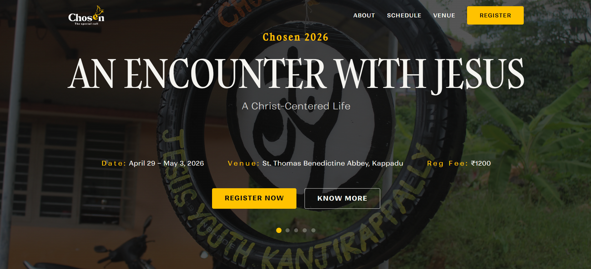
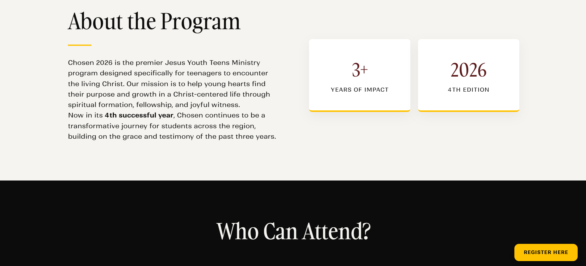
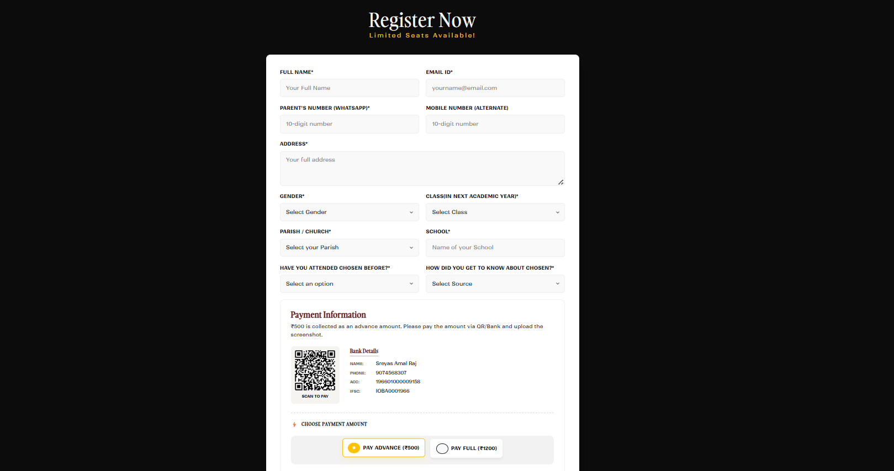

# ✨ Chosen – Ministry Event Website

A modern, responsive event website developed for **Jesus Youth Kanjirapally** to promote the **Chosen** ministry program, provide event information, and streamline participant registration.

The website combines an engaging user experience with smooth animations, countdowns, and multimedia content while integrating **Google Forms** for online registrations.

🌐 **Live Website:** https://chosen.jykply.in

---

## 📖 Overview

Chosen is a responsive event website developed for the **Jesus Youth Kanjirapally** ministry event. The website serves as the official platform for sharing event information, media, schedules, and participant registration.

The registration interface was custom-built as part of the website and integrated with **Google Forms** to collect and store participant responses efficiently, eliminating the need for manual registration management.
---

## ✨ Features

- 📱 Fully responsive design
- 🎨 Modern user interface
- ✨ Smooth scrolling and animations
- ⏳ Countdown timer
- 🖼 Image gallery
- 🎥 Video section
- 📝 Custom registration form integrated with Google Forms
- 📞 Contact section
- ⚡ Optimized for performancerformance and fast loading

---

## 🛠 Tech Stack

### Frontend

- HTML5
- CSS3
- JavaScript

### Tools

- Git
- GitHub
- Netlify
- Google Forms

---

## 📂 Project Structure

```text
chosen/
│
├── assets/
│   ├── css/
│   ├── js/
│   ├── images/
│   └── videos/
│
├── screenshots/
├── index.html
└── README.md
```

---

## 📸 Screenshots

### Home Page



### Event Information



### Gallery


### Registration



---

## 🚀 Live Demo

🌐 https://chosen.jykply.in

---

## ⚙️ Running Locally

Clone the repository:

```bash
git clone https://github.com/Codewith-Rony/chosen.git
```

Navigate to the project directory:

```bash
cd chosen
```

Open `index.html` in your browser.

---

## 📌 Project Highlights

- Built for a real ministry event
- Deployed using Netlify with a custom domain
- Automatic deployment through GitHub integration
- Mobile-first responsive design
- Google Forms integration for event registration

---

## 📈 Future Improvements

- Custom backend for registrations
- Admin dashboard
- Email notifications
- Event analytics
- CMS for content management

---

## 👨‍💻 Author

**Rony Thomas**

Software Engineer | Full Stack Developer

Portfolio: https://codewith-rony.github.io

GitHub: https://github.com/Codewith-Rony

LinkedIn: https://linkedin.com/in/rony-thomas3
